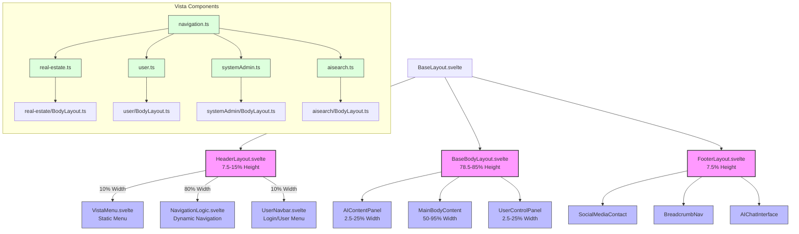

```mermaid
graph TD
    %% Main Layout Structure
    BaseLayout[BaseLayout.svelte] --> Header
    BaseLayout --> Body
    BaseLayout --> Footer

    %% Header Section with Percentages
    Header[HeaderLayout.svelte<br/>7.5-15% Height] -->|10% Width| VistasMenu[VistaMenu.svelte<br/>Static Menu]
    Header -->|80% Width| NavBar[NavigationLogic.svelte<br/>Dynamic Navigation]
    Header -->|10% Width| UserNav[UserNavbar.svelte<br/>Login/User Menu]

    %% Body Section with Dynamic Sizing
    Body[BaseBodyLayout.svelte<br/>78.5-85% Height] --> AIPanel[AIContentPanel<br/>2.5-25% Width]
    Body --> MainContent[MainBodyContent<br/>50-95% Width]
    Body --> UserPanel[UserControlPanel<br/>2.5-25% Width]

    %% Footer Section
    Footer[FooterLayout.svelte<br/>7.5% Height] --> Social[SocialMediaContact]
    Footer --> Breadcrumb[BreadcrumbNav]
    Footer --> Chat[AIChatInterface]

    %% Vista System
    subgraph "Vista Components"
        direction TB
        NavSystem[navigation.ts] --> RealEstate[real-estate.ts]
        NavSystem --> UserVista[user.ts]
        NavSystem --> AdminVista[systemAdmin.ts]
        NavSystem --> AIVista[aisearch.ts]

        RealEstate --> RealEstateLayout[real-estate/BodyLayout.ts]
        UserVista --> UserLayout[user/BodyLayout.ts]
        AdminVista --> AdminLayout[systemAdmin/BodyLayout.ts]
        AIVista --> AILayout[aisearch/BodyLayout.ts]
    end

    %% Styling
    classDef section fill:#f9f,stroke:#333,stroke-width:2px
    classDef component fill:#bbf,stroke:#333,stroke-width:1px
    classDef vista fill:#dfd,stroke:#333,stroke-width:1px

    class Header,Body,Footer section
    class VistasMenu,NavBar,UserNav,AIPanel,MainContent,UserPanel,Social,Breadcrumb,Chat component
    class NavSystem,RealEstate,UserVista,AdminVista,AIVista vista
```
